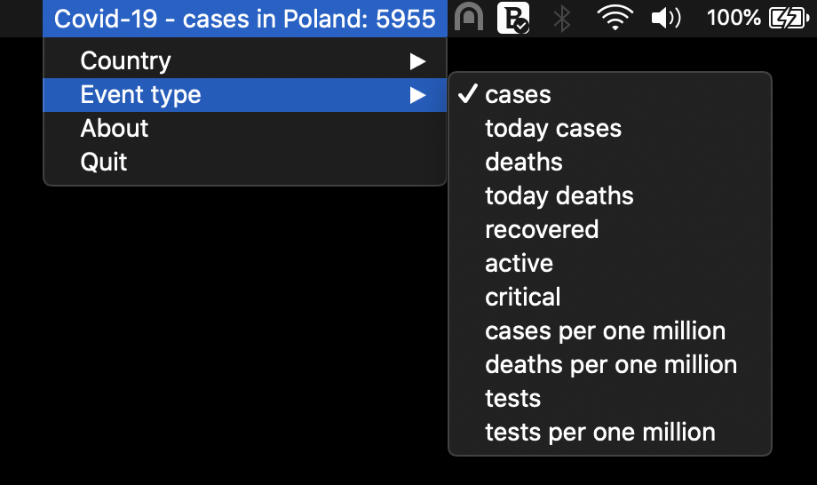

# Covid-19 Status Bar

Status bar app with Covid-19 country statistics (Mac only).

## Dependencies

* `rumps` - Ridiculously Uncomplicated macOS Python Statusbar apps  https://github.com/jaredks/rumps
* `requests` - Requests is an elegant and simple HTTP library for Python, built for human beings https://requests.readthedocs.io/en/latest/
* `NovelCOVID/API `API for Current cases and more stuff about COVID-19 or the Novel Coronavirus Strain https://corona.lmao.ninja/